<div align="center">




[](https://linkedin.com/in/YOUR-LINKEDIN-HANDLE)
[](mailto:darshanwarke.61@gmail.com)

</div>

<br>

<details open>
<summary><b>🖥️ terminal — whoami</b></summary>
<br>

```bash
darshan@ml-engineer:~$ whoami
> Data Scientist / ML Engineer

darshan@ml-engineer:~$ cat education.txt
> B.E. Artificial Intelligence & Machine Learning
> PG Certification — Data Science & Analytics (Imarticus Learning)

darshan@ml-engineer:~$ python skills.py --top
> ["Computer Vision", "NLP", "Explainable AI", "Production ML"]

darshan@ml-engineer:~$ status --current
> Seeking: Data Scientist / ML Engineer role
> Building: end-to-end ML systems that ship, not just notebooks
```

</details>

<br>

### 🛠️ Tech Stack

<div align="center">

**Machine Learning & AI**


**Data & Analysis**


**Languages & Tools**


</div>

<br>

### 📊 GitHub Stats

<div align="center">


</div>

<div align="center">

</div>

<div align="center">

</div>

<!-- SNAKE_START -->
<div align="center">

</div>
<!-- SNAKE_END -->

<br>

### 📌 Featured Projects

<table>
<tr>
<td width="50%" valign="top">

**💳 [Credit Card Fraud Detection](https://github.com/Darshanwarke7/credit-card-fraud-detection)**

`Python` `XGBoost` `SHAP` `SMOTE`

Analyzed 284K+ transactions with severe class imbalance → **99.2% ROC-AUC**, 87% precision-recall, with SHAP explainability for stakeholders.

</td>
<td width="50%" valign="top">

**📰 news-summarizer-sentiment-analyzer**

`Python` `NLTK` `VADER` `TextBlob`

Scraped 500+ articles, cut length by ~70% via TF-IDF summarization, and classified sentiment at **78% accuracy**.

</td>
</tr>
<tr>
<td width="50%" valign="top">

**🕳️ [Road Pothole Detection System](https://github.com/Darshanwarke7/pothole-detector)**

`YOLOv8` `TensorRT` `Raspberry Pi` `Flask`

Real-time detection on edge hardware at **~85% accuracy**, 40% faster inference via TensorRT, logged through a Flask + MySQL dashboard.

</td>
<td width="50%" valign="top">

**📺 [YouTube EDA Analysis](https://github.com/Darshanwarke7/YouTube-EDA-Analysis)**

`Python` `Pandas` `Jupyter`

Exploratory data analysis uncovering trends and patterns across YouTube video performance data.

</td>
</tr>
</table>

<br>

<details>
<summary><b>🎓 Education & Certifications</b></summary>
<br>

**Education**
- 🏫 Post Graduate Program — Data Science & Analytics, Imarticus Learning, Mumbai *(2025 – Mar 2026)*
- 🏫 B.E. in Artificial Intelligence & Machine Learning, Universal College of Engineering, Mumbai *(2021 – 2025)*

**Certifications & Achievements**


</details>

<br>

<div align="center">

### 📫 Let's Connect

[](https://linkedin.com/in/YOUR-LINKEDIN-HANDLE)
[](mailto:darshanwarke.61@gmail.com)
[](https://github.com/Darshanwarke7)


</div>
